# Misc

## 1.签到题
力竭了！

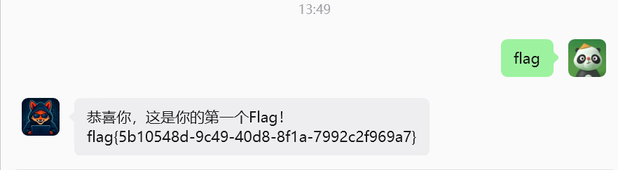

## 2.ezBase64

`ZmxhZ3syOGI5MjE3Mi00ZmRmLTQ1ZWItYjRhNy02MWVlNTRjNTZjMDV9`

数字0-9，大小写字母都有，cyberchef一波
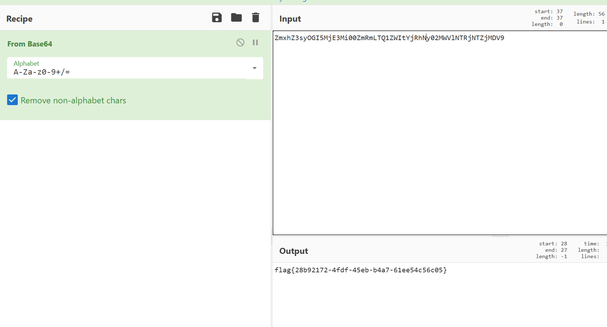

## 3.BaseCrack

```c
TEpXWFEyQzJHTjJHUVQyWExGM1ZTVjJHTkpNVkdNQlVMSktGS01LTUtSSkdXVEtVTk4yRTZWMjJOUk1YU01CVEpWVkZTTTJOR0pFVEdXVE5KWldVNFJDV0hFPT09PT09
```

base64-base32-base64，随波逐流三把梭也行
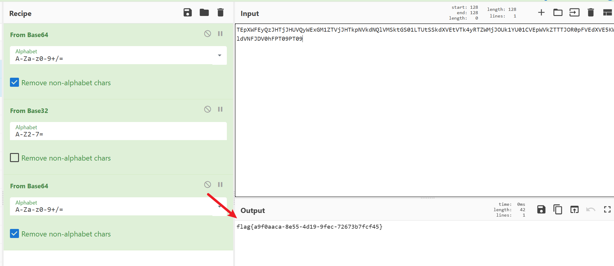

## 4.ROT13

随波逐流

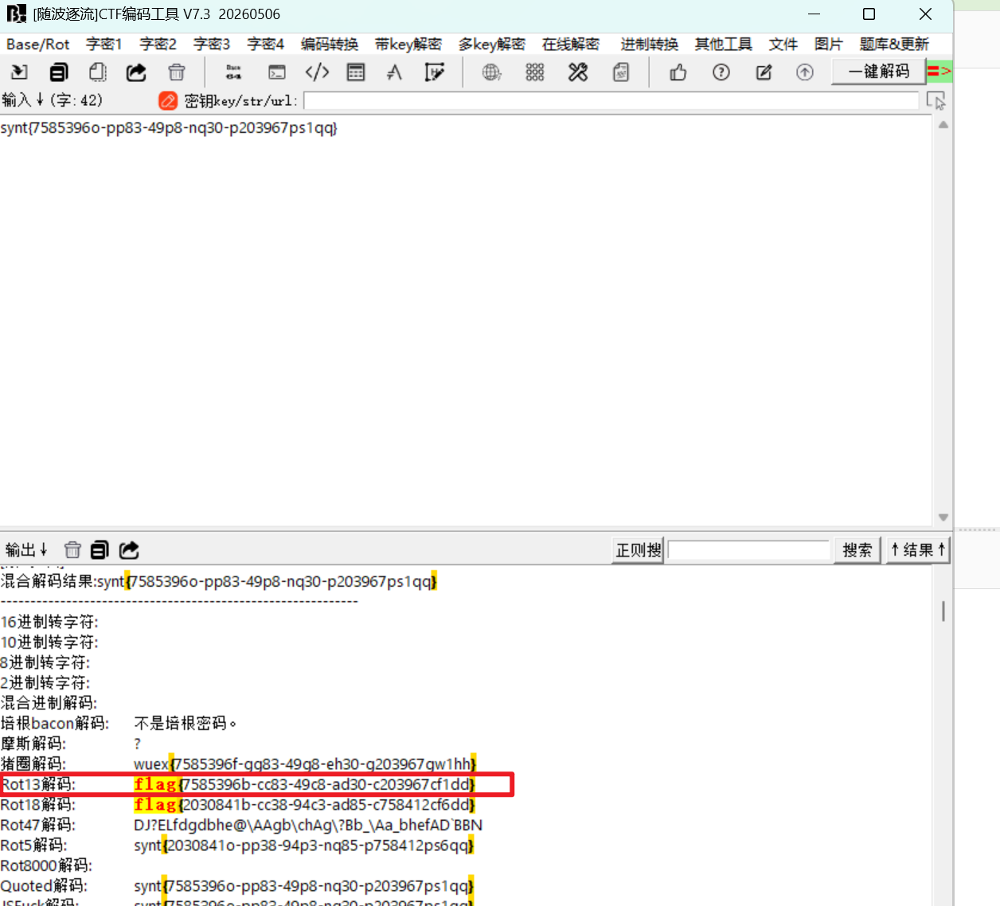

## 5.Rail Fence

`fa{d9486b-509e-197d25lgbc4a-3145-719bc6e0}`

栅栏特征，随波逐流看下结果

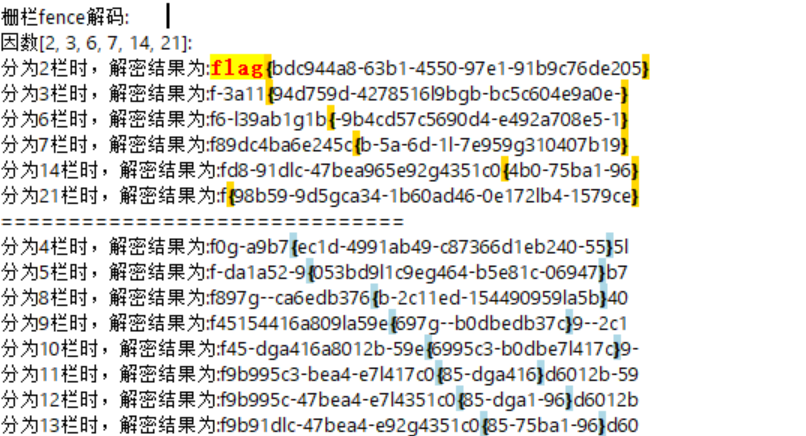

# Web

## 1.HTTP？GET？POST？
按要求传参
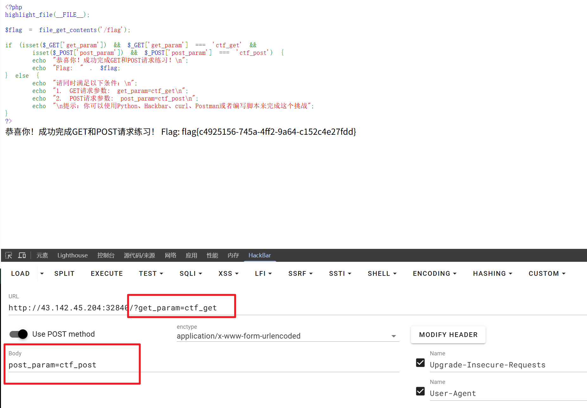

## 2.Robots.txt？
访问robots.txt，注意到flag.php

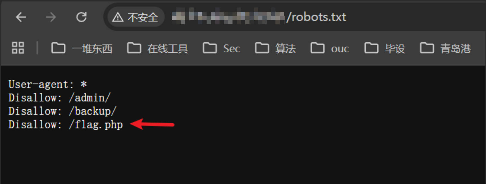

访问flag.php，查看源代码得flag
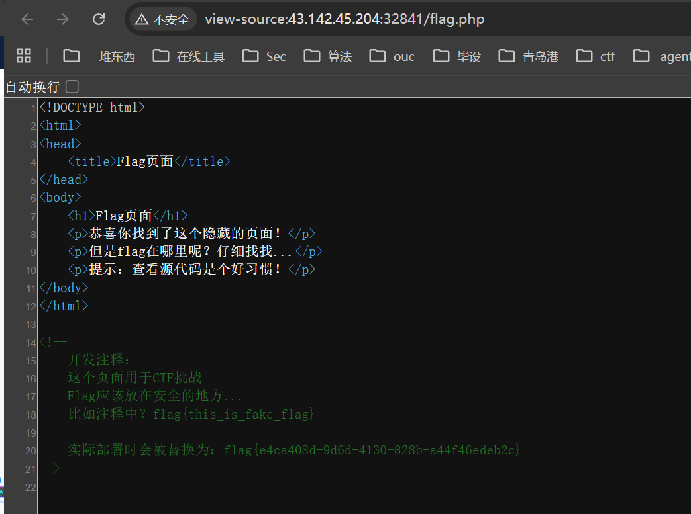

## 3.HTTP Header

按照要求，在请求体里添加响应字段

xff代表客户端ip地址，referer代表当前请求来源网址，具体修改内容如下
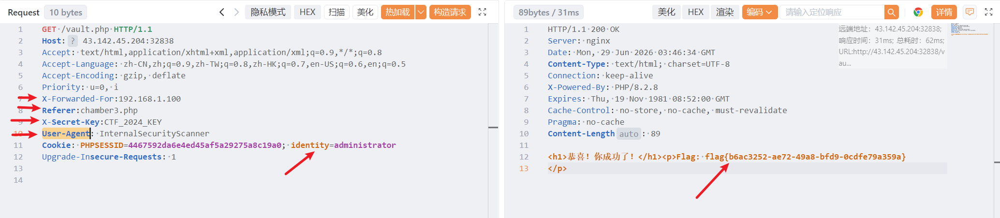

## 4.sql

看代码，post传入的两个参数直接拼接到sql语句执行，利用`' or 1`和`--+`绕过where条件，使得查询成功
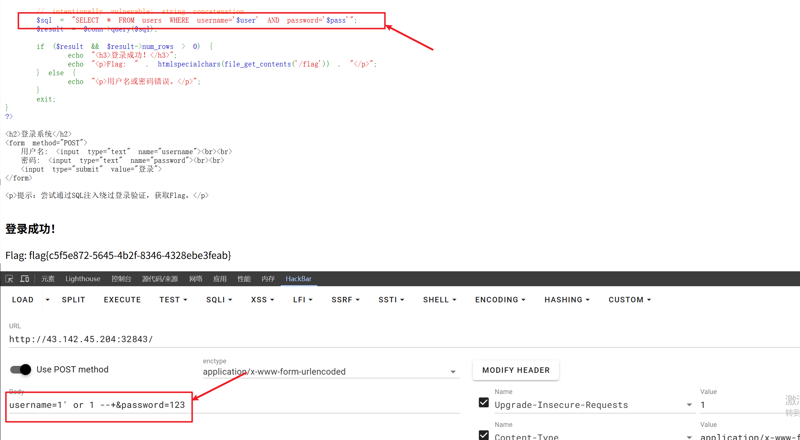

# Re

## 1.IDA Pro

64位，无壳

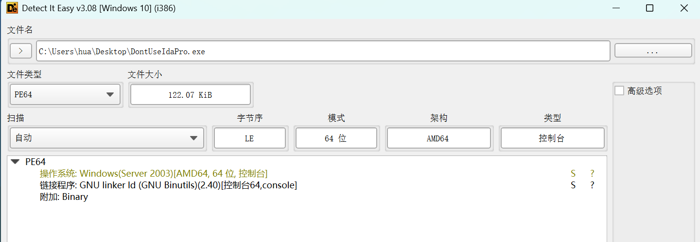

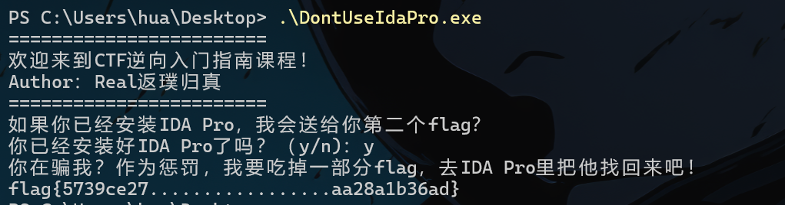

直接运行，flag显示不全，去ida看
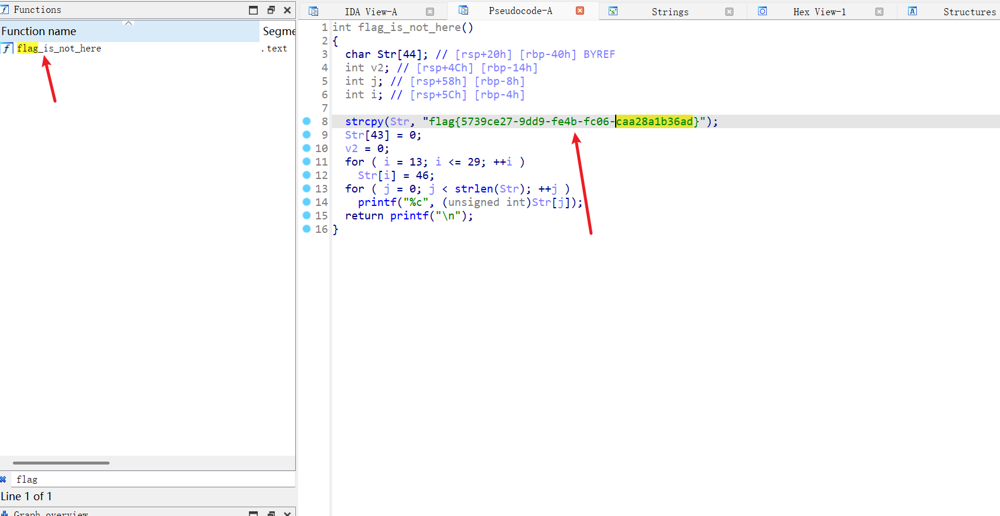

## 2.sign_in

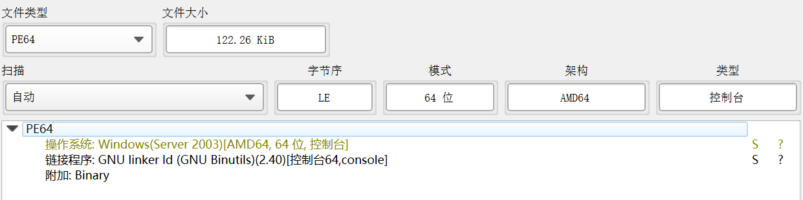

文件名说是string，直接shift+f12查看字符串
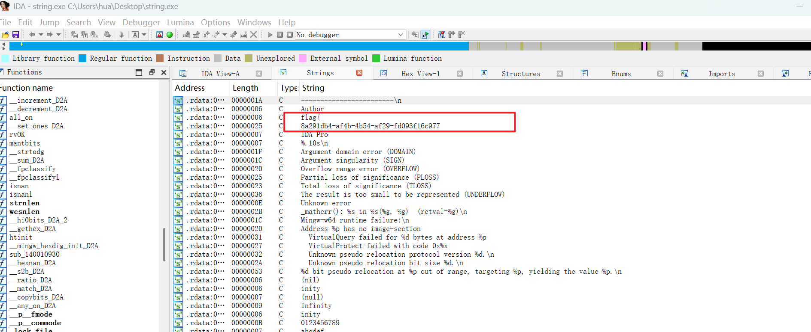

## 3.string

根据提示，shift+f12查看字符串
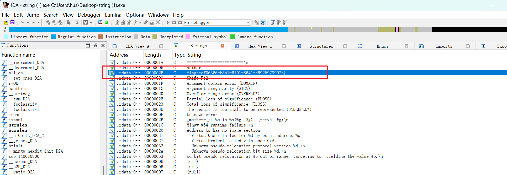

## 4.xor

ida打开，跟进`check_flag`函数

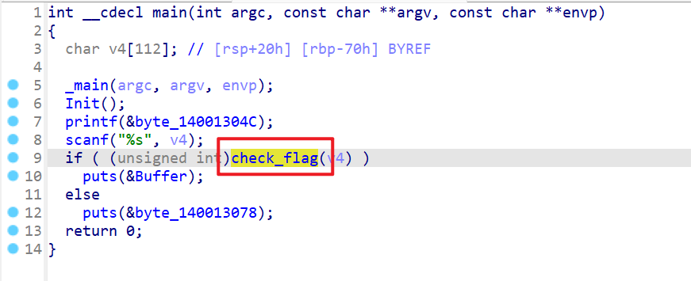

根据check_flag逻辑，将enc逐个与0x12异或

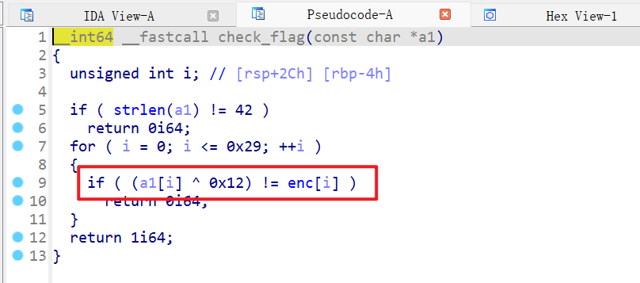

脚本如下

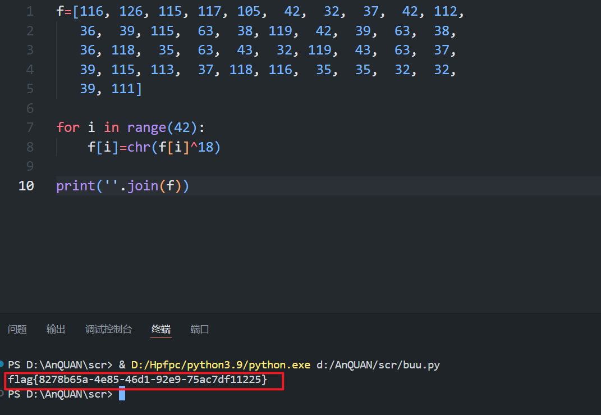
