下载bomb-lab附件，主要文件是bomb.c和bomb，c代码大致如下

```c
initialize_bomb();

    printf("Welcome to my fiendish little bomb. You have 6 phases with\n");
    printf("which to blow yourself up. Have a nice day!\n");

    /* Hmm...  Six phases must be more secure than one phase! */
    input = read_line();             /* Get input                   */
    phase_1(input);                  /* Run the phase               */
    phase_defused();                 /* Drat!  They figured it out!
				      * Let me know how they did it. */
    printf("Phase 1 defused. How about the next one?\n");

    /* The second phase is harder.  No one will ever figure out
     * how to defuse this... */
    input = read_line();
    phase_2(input);
    phase_defused();
    printf("That's number 2.  Keep going!\n");
```

有6个phase，每个phase都要输入一个字符串，且不让代码的explode_bomb触发，就算通关

## 1.phase_1

先用`b phase_1`下一个断点，`r`运行，`c`继续运行到下一个断点

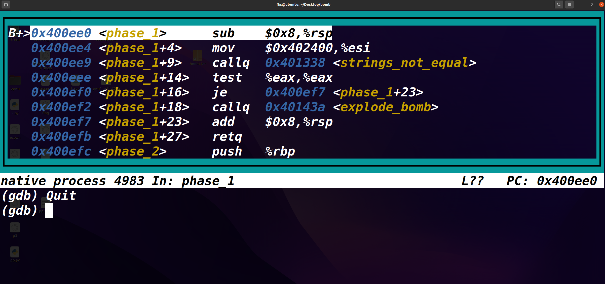

+18行这里，触发了爆炸，要想办法不走到这一步。往上看可以看到`test`和`je`，作用是如果eax寄存器为0，那么就会跳走不爆炸，那给`strings_not_equal`下个断点调试一下

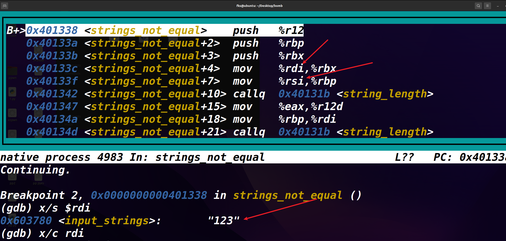

在`strings_not_equal`函数中，可以看到调用`string_length`的时候用的参数分别来自rdi和rsi，用`x/s $rdi`可以看到rdi寄存器放的就是我输入的字符串`123`的地址，那么rsi就应该是拿去比较的字符串的地址了


查看下rsi存放地址指向的内容，这串字符串就是`phase_1`应输出的字符串

`Border relations with Canada have never been better.`

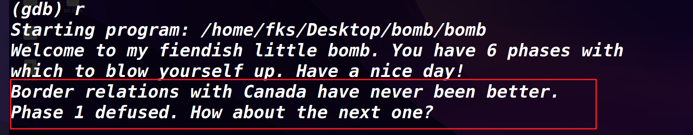

## 2.phase_2

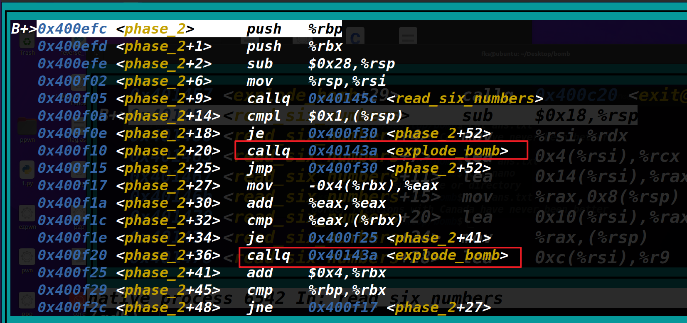

第二阶段有两个爆炸点。往上看可以看到`read_six_numbers`看函数名字，跟进一下

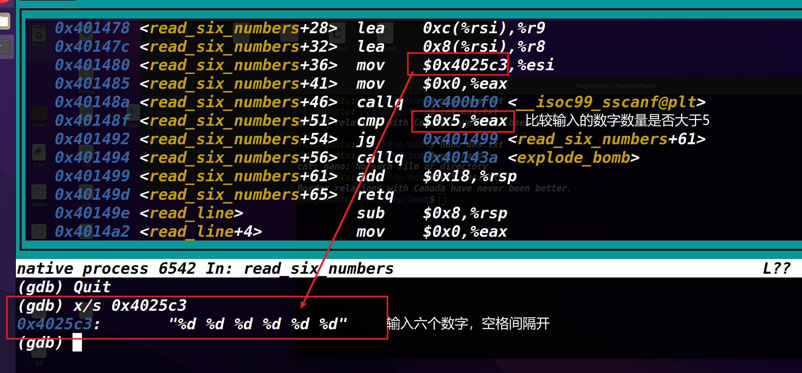

回到phase_2。要避开第一个炸弹，要求rsp的值为1，即可跳转。这里看一下跳转后的指令

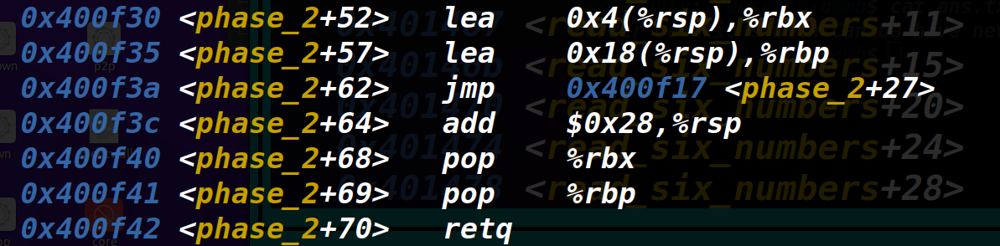

让rbx指向数字1的上一个数字。rbp指向第6个数字。然后直接跳转到27偏移的位置，继续看

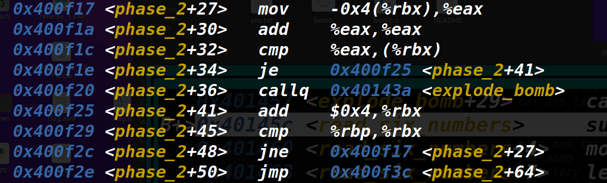

已知道rbx放的是1后面的数，这里前三行就是拿1后面的数与1本身的2倍进行比较。如果相等，跳到41行进行下一组的比对，这里就是一个循环。六个数从前往后应该是2倍的关系，即`1 2 4 8 16 32`

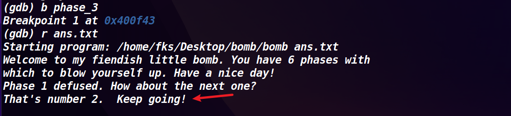

## 3.phase_3

先补充一下`sscanf`

```c
sscanf(char *string, char *format, arg1,arg2, arg3....)
其中%rdi 是指向string的指针
    %rsi 是指向format的指针
    %rdx，%rcx，%r8,%r9陆续存储arg1,agr2等等
该函数的返回值存储在%eax，返回赋值变量个数。通常函数的返回值都在eax寄存器
```

汇编如下

```x86asm
    0x400f43 <phase_3>      sub    $0x18,%rsp                                                                       │
│   0x400f47 <phase_3+4>    lea    0xc(%rsp),%rcx      //arg2                                                             │
│   0x400f4c <phase_3+9>    lea    0x8(%rsp),%rdx      //arg1                                                            │
│   0x400f51 <phase_3+14>   mov    $0x4025cf,%esi                                                                   │
│   0x400f56 <phase_3+19>   mov    $0x0,%eax                                                                        │
│   0x400f5b <phase_3+24>   callq  0x400bf0 <__isoc99_sscanf@plt>                                                   │
│   0x400f60 <phase_3+29>   cmp    $0x1,%eax                                                                        │
│   0x400f63 <phase_3+32>   jg     0x400f6a <phase_3+39>                                                            │
│   0x400f65 <phase_3+34>   callq  0x40143a <explode_bomb>                                                          │
│   0x400f6a <phase_3+39>   cmpl   $0x7,0x8(%rsp)                                                                   │
│   0x400f6f <phase_3+44>   ja     0x400fad <phase_3+106>                                                           │
│   0x400f71 <phase_3+46>   mov    0x8(%rsp),%eax                                                                   │
│   0x400f75 <phase_3+50>   jmpq   *0x402470(,%rax,8)                                                               │
│   0x400f7c <phase_3+57>   mov    $0xcf,%eax                                                                       │
│   0x400f81 <phase_3+62>   jmp    0x400fbe <phase_3+123>                                                           │
│   0x400f83 <phase_3+64>   mov    $0x2c3,%eax    

    0x400f88 <phase_3+69>   jmp    0x400fbe <phase_3+123>                                                           │
│   0x400f8a <phase_3+71>   mov    $0x100,%eax                                                                      │
│   0x400f8f <phase_3+76>   jmp    0x400fbe <phase_3+123>                                                           │
│   0x400f91 <phase_3+78>   mov    $0x185,%eax                                                                      │
│   0x400f96 <phase_3+83>   jmp    0x400fbe <phase_3+123>                                                           │
│   0x400f98 <phase_3+85>   mov    $0xce,%eax                                                                       │
│   0x400f9d <phase_3+90>   jmp    0x400fbe <phase_3+123>                                                           │
│   0x400f9f <phase_3+92>   mov    $0x2aa,%eax                                                                      │
│   0x400fa4 <phase_3+97>   jmp    0x400fbe <phase_3+123>                                                           │
│   0x400fa6 <phase_3+99>   mov    $0x147,%eax                                                                      │
│   0x400fab <phase_3+104>  jmp    0x400fbe <phase_3+123>                                                           │
│   0x400fad <phase_3+106>  callq  0x40143a <explode_bomb>                                                          │
│   0x400fb2 <phase_3+111>  mov    $0x0,%eax                                                                        │
│   0x400fb7 <phase_3+116>  jmp    0x400fbe <phase_3+123>                                                           │
│   0x400fb9 <phase_3+118>  mov    $0x137,%eax                                                                      │
│   0x400fbe <phase_3+123>  cmp    0xc(%rsp),%eax 
       
    0x400fc2 <phase_3+127>  je     0x400fc9 <phase_3+134>                                                           │
│   0x400fc4 <phase_3+129>  callq  0x40143a <explode_bomb>                                                          │
│   0x400fc9 <phase_3+134>  add    $0x18,%rsp                                                                       │
│   0x400fcd <phase_3+138>  retq                          
```

从上往下看。输入的参数数量要大于1，这样就避开了第一个炸弹。这里看%esi也能看出来是要两个整数输入。

之后会跳转到`phase_3+39`（后面统称+39），会拿第一个参数与7比较，大于7则爆炸。

那么第一个参数小于7就行了。

接着看+46处，第一个参数放到eax里面。然后有一行

```x86asm
0x400f75 <phase_3+50>   jmpq   *0x402470(,%rax,8) 
```

这句话执行后，跳转的地址是去`0x402470+(%rax*8)`中取指针

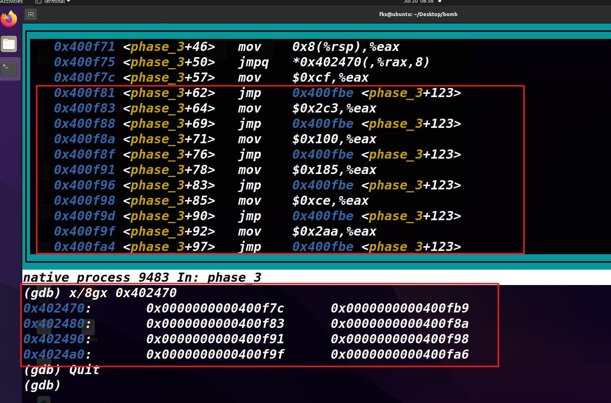

通过查看这个偏移地址及指令结构，看得出是一个switch分支，进入分支后最终会走到+123处

```x86asm
    0x400fbe <phase_3+123>  cmp    0xc(%rsp),%eax                                                    │
│   0x400fc2 <phase_3+127>  je     0x400fc9 <phase_3+134>                                            │
│   0x400fc4 <phase_3+129>  callq  0x40143a <explode_bomb>                                           │
│   0x400fc9 <phase_3+134>  add    $0x18,%rsp           
```

分析123处的代码，得知我们的第二个参数应该是第一个参数作为分支索引，进入分支后赋的值为准

那第一个参数就给个0，进入第一个分支，赋值`0xcf`

那就输入`0 207`

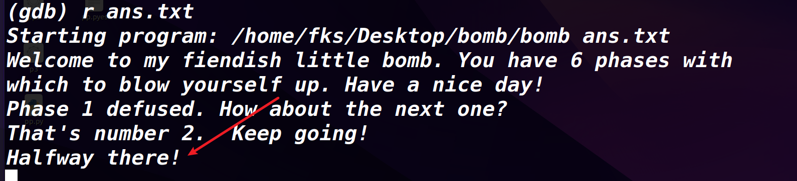

## 4.phase_4

依旧是输两个数

```x86asm
    0x40102e <phase_4+34>   cmpl   $0xe,0x8(%rsp)                                    
│   0x401033 <phase_4+39>   jbe    0x40103a <phase_4+46>   
    0x401035 <phase_4+41>   callq  0x40143a <explode_bomb>   
```

这里要绕过爆炸，第一个参数应该小于等于14(0xe)。再看剩余部分

```x86asm
│	0x40103a <phase_4+46>   mov    $0xe,%edx                                             
│   0x40103f <phase_4+51>   mov    $0x0,%esi                                             
│   0x401044 <phase_4+56>   mov    0x8(%rsp),%edi                                        
│   0x401048 <phase_4+60>   callq  0x400fce <func4>                                                 
```

由上面的指令知：将14传到edx，0传到esi然后调用func4函数，

```x86asm
│   0x40104d <phase_4+65>   test   %eax,%eax                                             
│   0x40104f <phase_4+67>   jne    0x401058 <phase_4+76>                                
│   0x401051 <phase_4+69>   cmpl   $0x0,0xc(%rsp)                                        
│   0x401056 <phase_4+74>   je     0x40105d <phase_4+81>
│	0x401058 <phase_4+76>   callq  0x40143a <explode_bomb>                               
│   0x40105d <phase_4+81>   add    $0x18,%rsp                                            
│   0x401061 <phase_4+85>   retq     
```

调用func4之后，返回值在eax。从phase_4函数的汇编可以知道要求func4的返回值为0。

并且由`cmpl   $0x0,0xc(%rsp)`知，输的第二个参数必须是0

```x86asm
目前已知条件：
1.第一个参数<=14
2.func4的返回值为0
3.第二个参数=0
```

```x86asm
│	0x400fce <func4>        sub    $0x8,%rsp                             
│   0x400fd2 <func4+4>      mov    %edx,%eax                             │
│   0x400fd4 <func4+6>      sub    %esi,%eax                             │
│   0x400fd6 <func4+8>      mov    %eax,%ecx                             │
│   0x400fd8 <func4+10>     shr    $0x1f,%ecx                            │
│   0x400fdb <func4+13>     add    %ecx,%eax                             │
│   0x400fdd <func4+15>     sar    %eax     
│	0x400fdf <func4+17>     lea    (%rax,%rsi,1),%ecx                    │
│   0x400fe2 <func4+20>     cmp    %edi,%ecx                             │
│   0x400fe4 <func4+22>     jle    0x400ff2 <func4+36>                   │
│   0x400fe6 <func4+24>     lea    -0x1(%rcx),%edx                       │
│   0x400fe9 <func4+27>     callq  0x400fce <func4>                      │
│   0x400fee <func4+32>     add    %eax,%eax                             │
│   0x400ff0 <func4+34>     jmp    0x401007 <func4+57>                   │
│   0x400ff2 <func4+36>     mov    $0x0,%eax                             │
│   0x400ff7 <func4+41>     cmp    %edi,%ecx   
│	0x400ff9 <func4+43>     jge    0x401007 <func4+57>                   
│   0x400ffb <func4+45>     lea    0x1(%rcx),%esi                        │
│   0x400ffe <func4+48>     callq  0x400fce <func4>                      │
│   0x401003 <func4+53>     lea    0x1(%rax,%rax,1),%eax                 │
│   0x401007 <func4+57>     add    $0x8,%rsp                             │
│   0x40100b <func4+61>     retq            
```

两个参数的问题好办，现在根据上方汇编看下怎样让`func4`的返回值为0

这里关注+36处，这里给eax赋值为0。从这往上看，发现要做到`eax<=edi`。

也就是第一个参数要大于等于eax的值，注意到phase_4调用func4的时候，edx赋值为14（0xe），14传进来会导致eax为7。那第一个参数传7就满足条件1和条件2了。

最终输入`7 0`即可

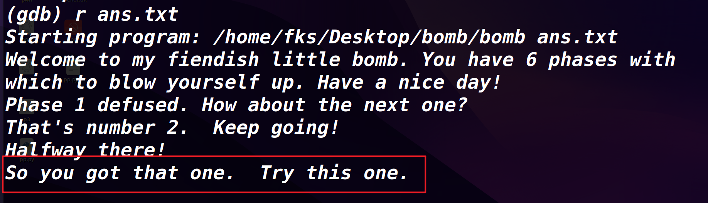

## 5.phase_5

```x86asm
	0x401062 <phase_5>      push   %rbx                                                                                                                                  
│   0x401063 <phase_5+1>    sub    $0x20,%rsp                                                                                                                            
│   0x401067 <phase_5+5>    mov    %rdi,%rbx                                                                                                                             
│   0x40106a <phase_5+8>    mov    %fs:0x28,%rax                                                                                                                         
│   0x401073 <phase_5+17>   mov    %rax,0x18(%rsp)                                                                                                                       
│   0x401078 <phase_5+22>   xor    %eax,%eax                                                                                                                             
│   0x40107a <phase_5+24>   callq  0x40131b <string_length>                                                                                                              
│   0x40107f <phase_5+29>   cmp    $0x6,%eax                                                                                                                             
│   0x401082 <phase_5+32>   je     0x4010d2 <phase_5+112>                                                                                                                
│   0x401084 <phase_5+34>   callq  0x40143a <explode_bomb>                                                                                                               
│   0x401089 <phase_5+39>   jmp    0x4010d2 <phase_5+112>                                                                                                                
│   0x40108b <phase_5+41>   movzbl (%rbx,%rax,1),%ecx                                                                                                                    
│   0x40108f <phase_5+45>   mov    %cl,(%rsp)          
	0x401092 <phase_5+48>   mov    (%rsp),%rdx                                                                                                                           
│   0x401096 <phase_5+52>   and    $0xf,%edx                                                                                                                             
│   0x401099 <phase_5+55>   movzbl 0x4024b0(%rdx),%edx                                                                                                                   
│   0x4010a0 <phase_5+62>   mov    %dl,0x10(%rsp,%rax,1)                                                                                                                 
│   0x4010a4 <phase_5+66>   add    $0x1,%rax                                                                                                                             
│   0x4010a8 <phase_5+70>   cmp    $0x6,%rax                                                                                                                             
│   0x4010ac <phase_5+74>   jne    0x40108b <phase_5+41>                                                                                                                 
│   0x4010ae <phase_5+76>   movb   $0x0,0x16(%rsp)                                                                                                                       
│   0x4010b3 <phase_5+81>   mov    $0x40245e,%esi                                                                                                                        
│   0x4010b8 <phase_5+86>   lea    0x10(%rsp),%rdi     
	0x4010bd <phase_5+91>   callq  0x401338 <strings_not_equal>                                                                                                          
│   0x4010c2 <phase_5+96>   test   %eax,%eax                                                                                                                             
│   0x4010c4 <phase_5+98>   je     0x4010d9 <phase_5+119>                                                                                                                
│   0x4010c6 <phase_5+100>  callq  0x40143a <explode_bomb>                                                                                                               
│   0x4010cb <phase_5+105>  nopl   0x0(%rax,%rax,1)                                                                                                                      
│   0x4010d0 <phase_5+110>  jmp    0x4010d9 <phase_5+119>                                                                                                                
│   0x4010d2 <phase_5+112>  mov    $0x0,%eax                                                                                                                             
│   0x4010d7 <phase_5+117>  jmp    0x40108b <phase_5+41>                                                                                                                 
│   0x4010d9 <phase_5+119>  mov    0x18(%rsp),%rax                                                                                                                       
│   0x4010de <phase_5+124>  xor    %fs:0x28,%rax 
	0x4010e7 <phase_5+133>  je     0x4010ee <phase_5+140>                                                                                                                
│   0x4010e9 <phase_5+135>  callq  0x400b30 <__stack_chk_fail@plt>                                                                                                       
│   0x4010ee <phase_5+140>  add    $0x20,%rsp                                                                                                                            
│   0x4010f2 <phase_5+144>  pop    %rbx                                                                                                                                  
│   0x4010f3 <phase_5+145>  retq             
```


```x86asm
	0x40107a <phase_5+24>   callq  0x40131b <string_length>                                                                                                              
│   0x40107f <phase_5+29>   cmp    $0x6,%eax                                                                                                                             
│   0x401082 <phase_5+32>   je     0x4010d2 <phase_5+112>    
```

要求输入6位的字符

```x86asm
	0x40108b <phase_5+41>   movzbl (%rbx,%rax,1),%ecx                                                                                                                    │
│   0x40108f <phase_5+45>   mov    %cl,(%rsp)                                                                                                                            │
│   0x401092 <phase_5+48>   mov    (%rsp),%rdx                                                                                                                           │
│   0x401096 <phase_5+52>   and    $0xf,%edx                                                                                                                             │
│   0x401099 <phase_5+55>   movzbl 0x4024b0(%rdx),%edx                                                                                                                   │
│   0x4010a0 <phase_5+62>   mov    %dl,0x10(%rsp,%rax,1)                                                                                                                 │
│   0x4010a4 <phase_5+66>   add    $0x1,%rax                                                                                                                             │
│   0x4010a8 <phase_5+70>   cmp    $0x6,%rax                                                                                                                             │
│   0x4010ac <phase_5+74>   jne    0x40108b <phase_5+41>
```

这里是一个循环，等价于如下代码 （输入的值在rbx）

`注：对任意32位通用寄存器执行写操作的时候，会自动清空对应64位寄存器的高位部分`

```c++
for（rax=0;rax!=6;rax++)
{
	ecx=*(rbx+rax)          //取用户输入字符串第rax个字符，零扩展放到ecx中
	*rsp=cl
	rdx=*rsp                
	edx=rdx & 0xf           //edx保留字符低4bit，得到0-15作为下标
	edx=*（rdx+0x4024b0）    //取字符串偏移后的字符
	*（rsp+rax+0x10）=dl     //字符串存到栈上
}
```

`0x4024b0`处取16位为`maduiersnfotvbyl`

出循环后指令如下

```x86asm
	0x4010ae <phase_5+76>   movb   $0x0,0x16(%rsp)            //字符串结束符                                                                                                           │
│   0x4010b3 <phase_5+81>   mov    $0x40245e,%esi                                                                                                                        │
│   0x4010b8 <phase_5+86>   lea    0x10(%rsp),%rdi                                                                                                                       │
│   0x4010bd <phase_5+91>   callq  0x401338 <strings_not_equal>                                                                                                          │
│   0x4010c2 <phase_5+96>   test   %eax,%eax                                                                                                                             │
│   0x4010c4 <phase_5+98>   je     0x4010d9 <phase_5+119>                                                                                                                │
│   0x4010c6 <phase_5+100>  callq  0x40143a <explode_bomb>                                                                                                               │
│   0x4010cb <phase_5+105>  nopl   0x0(%rax,%rax,1)                                                                                                                      │
│   0x4010d0 <phase_5+110>  jmp    0x4010d9 <phase_5+119>                                                                                                                │
│   0x4010d2 <phase_5+112>  mov    $0x0,%eax                                                                                                                             │
│   0x4010d7 <phase_5+117>  jmp    0x40108b <phase_5+41>                                                                                                                 │
│   0x4010d9 <phase_5+119>  mov    0x18(%rsp),%rax                                                                                                                       │
│   0x4010de <phase_5+124>  xor    %fs:0x28,%rax
```

```x86asm
│   0x4010b3 <phase_5+81>   mov    $0x40245e,%esi                                                                                                                        │
│   0x4010b8 <phase_5+86>   lea    0x10(%rsp),%rdi 
```

传入`0x40245e`处的字符串与之前循环产生的字符串，去比较


整理一下思路，用户需要输入六位字符串，起到下标的作用，作为下标在`maduiersnfotvbyl`中取出六位，需要等于`flyers`

用户输入的六个字符，每位都要进行`&0xf`运算后作为索引

`flyers`在`maduiersnfotvbyl`中对应的下标是9，15，14，5，6，7

所以按照这六个数，看ascii码表中低4位为这些值的就可以

即`ionefg`

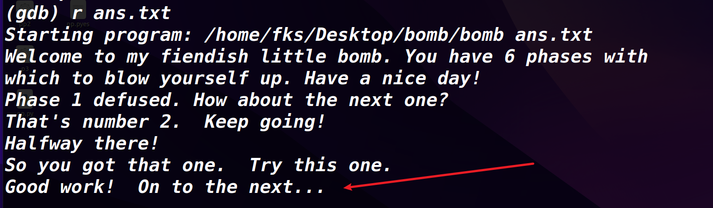

## 6.phase_6


